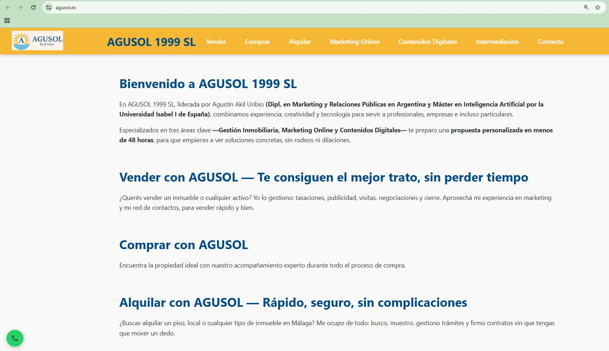

# AGUSOL 1999 SL – Web Corporativa

**Autora:** Josefa Macías Manceras  
**Periodo de desarrollo:** Junio – Agosto 2025 (prácticas laborales)  
**Tecnologías:** HTML5, CSS3, JavaScript (sin frameworks)  
**Demo:** [https://agusol.es](https://agusol.es)

---

## Captura de pantalla

---

## Descripción

Sitio web corporativo de **AGUSOL 1999 SL**, empresa especializada en:  
- Gestión inmobiliaria (alquileres, compraventa, traspasos)  
- Marketing online y contenidos digitales  
- Intermediación comercial  

El proyecto es **completamente estático**, responsive y optimizado para SEO, con animaciones suaves y botón flotante de contacto por WhatsApp.

---

## Características principales

- **HTML + CSS + JS nativos**, sin dependencias externas  
- **Diseño responsive** con menú hamburguesa y submenús móviles  
- **Scroll suave y animaciones fade-in** al navegar por secciones  
- **Metadatos completos (Open Graph, Twitter Card)** para mejor visibilidad  
- **Sección de clientes y colaboradores** con logotipos en cuadrícula adaptable  
- **Botón flotante de WhatsApp** con animación de vibración  

--

## Configuración del dominio

Además del desarrollo web, se realizó la configuración de los dominios asociados a AGUSOL 1999 SL:

- Gestión de registros DNS en **Arsys**, apuntando a GitHub Pages.  
- Redirecciones de **agusol.eu** y **agusol.net** hacia **agusol.es** (dominio principal).  
- Configuración de certificados SSL automáticos proporcionados por GitHub Pages.

---

## Estructura del proyecto

/ ├── index.html     # Página principal 
├── style.css        # Estilos y animaciones 
├── banner.jpg       # Banner superior 
├── logo.jpg         # Logotipo 
├── whatsapp-icon.png 
├── /logos           # Logotipos de clientes 
├── /assets          # Captura de pantalla u otras imágenes └── favicon.*        # Favicons

---

Contacto

Para consultas sobre la empresa o la web:
Email: agustin@agusol.com
Teléfono / WhatsApp: +34 664 088 605

---

Nota

Este proyecto fue desarrollado por Josefa Macías Manceras durante sus prácticas laborales (junio – agosto 2025).
La entrega incluye todo el código y archivos necesarios para su funcionamiento, sin compromiso de mantenimiento posterior.

Más sobre mí:
LinkedIn
https://www.linkedin.com/in/josefa-macias

GitHub personal
https://github.com/saldyard
